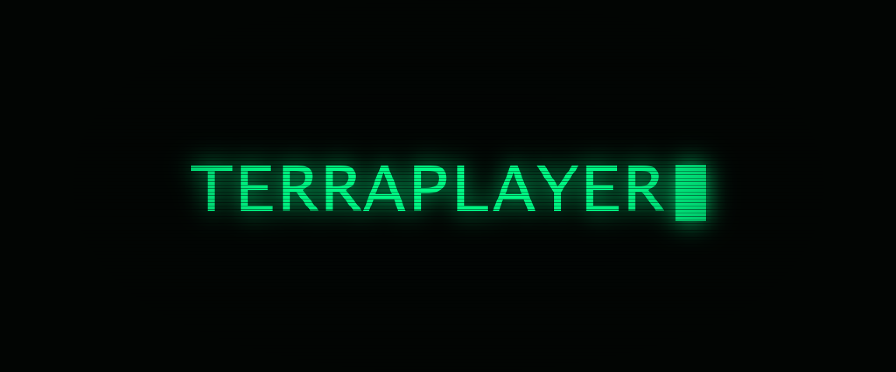
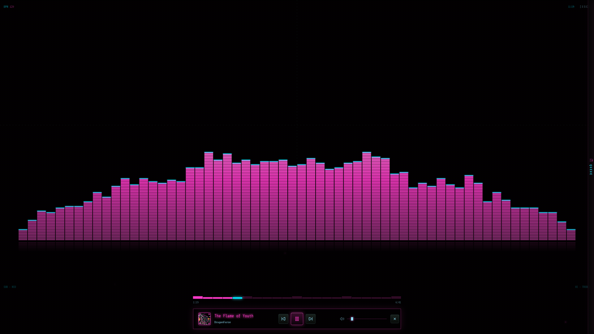
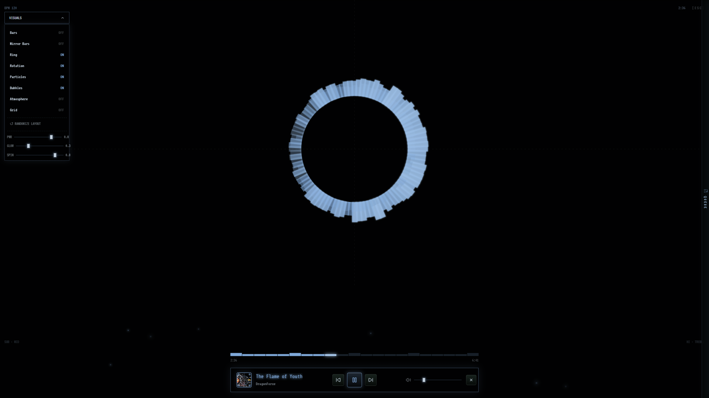
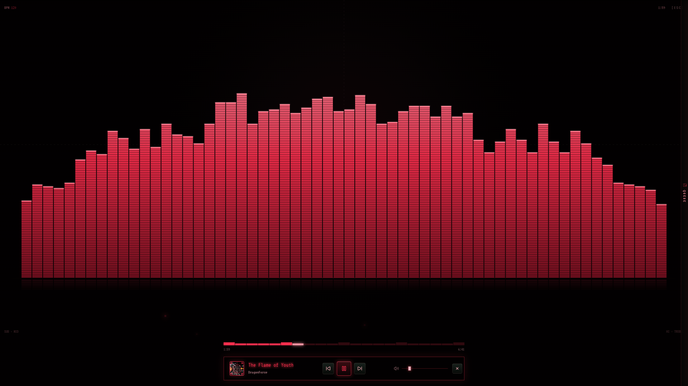
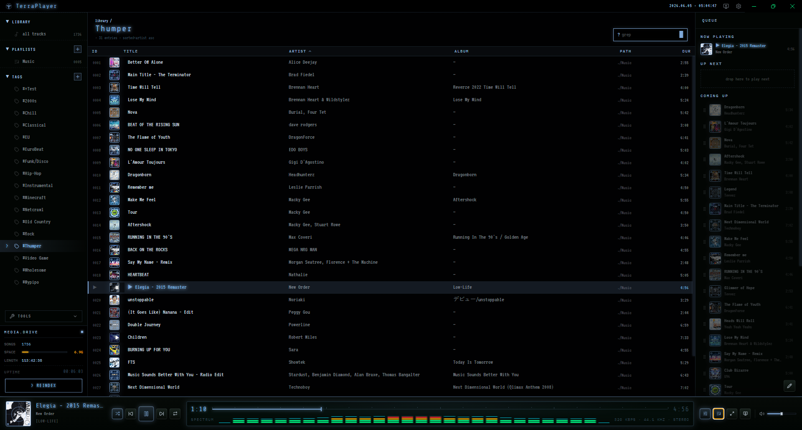
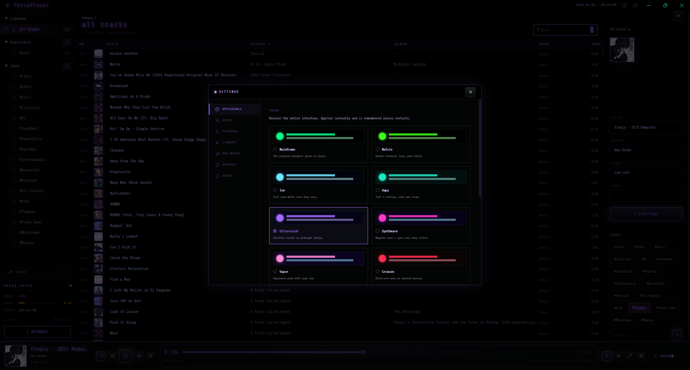
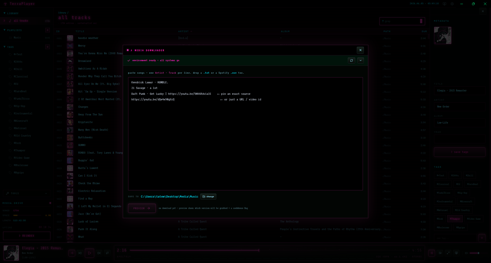
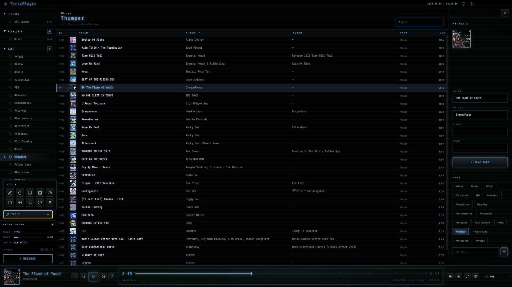

<p align="center">
  
</p>

<p align="center">
  <strong>An offline music player like no other.</strong><br/>
  A local-first desktop player with a y2k phosphor-CRT soul — your folders, your files, no internet required.
</p>

<p align="center">
  <a href="LICENSE"></a>
  <a href="https://github.com/TerraByte-Dev/TerraPlayer/releases/latest"></a>
  <a href="https://github.com/TerraByte-Dev/TerraPlayer/releases/latest"></a>
  
  
</p>

<p align="center">
  <a href="#get-started">Get started</a> ·
  <a href="#features">Features</a> ·
  <a href="#screenshots">Screenshots</a> ·
  <a href="#architecture">Architecture</a> ·
  <a href="#build-from-source">Build from source</a> ·
  <a href="LICENSE">License</a>
</p>

<p align="center">
  <sub>brought to you by</sub><br/>
  <a href="https://github.com/TerraByte-Dev"></a>
</p>

---

TerraPlayer points at folders of music you already own, indexes them into a local **SQLite** library, and plays
them through a custom in-process stream — wrapped in a green-phosphor mainframe UI with a visualizer built for a
second monitor. It's **genuinely offline**: no account, no telemetry, no open ports, fonts bundled — a fresh
launch makes **zero** network requests. The only thing that ever touches the internet is the optional, explicit
music downloader, and only when you ask it to.

## Get started

### Just want to listen? (no setup)

1. **[Download the latest release](https://github.com/TerraByte-Dev/TerraPlayer/releases/latest)** and run the
   installer.
2. **Drag a folder of music onto the window** — that's the whole setup. It scans on the spot and adopts it as
   your library. (Prefer a button? **Add folder** does the same.) Hit play.

That's it — no account, no command line, nothing to configure. The app installs and opens straight into your
library, and you can **check for updates** from GitHub Releases in one click (Settings → Updates). Everything
else (EQ, crossfade, themes, the fullscreen visualizer) lives behind the gear icon and the player bar.

> **🎵 Want to download music from inside the app?** That single optional feature needs **[Python 3](https://www.python.org/)**
> on your system (plus `yt-dlp` and `ffmpeg`). You don't have to set this up by hand — TerraPlayer checks what's
> missing and offers a one-click **"Fix it for me"**. **The player itself needs none of this**; it's only for the
> downloader. Details: [`DOWNLOADER.md`](DOWNLOADER.md).

## Features

- **Your library, your files** — **drag a folder onto the window** (or use the picker) and a recursive scan indexes your `.mp3` / `.m4a` into SQLite. Instant search, playlists, a genre / mood / custom **tag** system, and a built-in metadata + cover-art editor (procedural cover art for files without embedded art). **Rename** any playlist or tag in place (double-click it in the sidebar) and **add the selected song to a playlist** — existing or brand-new — right from the side panel.
- **A real audio chain** — a **10-band graphic EQ** with a dozen presets, pre-amp, true mono downmix, **crossfade between songs**, and pitch-preserved **playback speed** — all native Web Audio ([`AUDIO.md`](AUDIO.md)).
- **A visualizer worth a second monitor** — a live spectrum in the player bar plus a **fullscreen visualizer** (a rotating frequency ring, spectrum bars, particles, shockwaves) that **recolors with your theme** and pops out to a second display ([`VISUALIZER.md`](VISUALIZER.md)).
- **100% offline & private** — no account, no telemetry, no listening sockets; fonts are vendored locally. Your data is a local SQLite database that never leaves your machine.
- **Optional in-app downloader** — paste `Artist - Track` (or a URL) and pull new songs straight into your library, preferring the original/explicit master. Wraps `yt-dlp`, previews each match, and lets you swap the exact version before downloading. The *only* networked feature — opt-in; see [`DOWNLOADER.md`](DOWNLOADER.md).
- **It's hiding more than music** — poke around and you'll turn up a little dock of tools… and a few games to lose an afternoon to. Half the fun is finding them. _(Spoilers in [`TOOLS.md`](TOOLS.md), if you really must.)_
- **12 themes, whole-app** — a CRT phosphor-green default plus 11 recolors (Matrix, Ice, Aqua, Ultraviolet, Synthwave, Vapor, Crimson, Tangerine…) that recolor the entire UI **and the visualizer**, applied **before first paint** so there's no flash; plus scanline + reduced-motion toggles ([`SETTINGS.md`](SETTINGS.md)).
- **Keyboard-first, with a built-in updater** — global transport shortcuts (space · seek · prev/next · volume · mute), and a one-click in-app updater that pulls new versions from GitHub Releases on demand.

## Screenshots

<p align="center">
  
</p>
<p align="center">
  <sub><b>The fullscreen visualizer</b> — the hero. It reacts to the music, pops out to a second display, and <b>recolors with your theme</b>.</sub>
</p>

<table>
  <tr>
    <td width="50%" valign="top">
      <br/>
      <sub><b>The radial ring</b> — rotating frequency spokes, with the live controls (bars, ring, rotation, particles, glow…).</sub>
    </td>
    <td width="50%" valign="top">
      <br/>
      <sub><b>Same visualizer, your theme</b> — the colors follow the active app theme, live.</sub>
    </td>
  </tr>
</table>

<table>
  <tr>
    <td width="50%" valign="top">
      <br/>
      <sub><b>Library</b> — your folders indexed into a searchable track list, with playlists, tags &amp; a live queue.</sub>
    </td>
    <td width="50%" valign="top">
      <br/>
      <sub><b>Themes</b> — 12 phosphor recolors that restyle the entire interface instantly.</sub>
    </td>
  </tr>
  <tr>
    <td width="50%" valign="top">
      <br/>
      <sub><b>Downloader</b> — pull new songs into your library, preview &amp; pick the version (opt-in, needs Python).</sub>
    </td>
    <td width="50%" valign="top">
      <br/>
      <sub><b>The whole UI recolors</b> — here the library in the <i>Slate</i> theme.</sub>
    </td>
  </tr>
</table>

## Architecture

Electron **main** ↔ **preload** (`contextBridge` → `window.hub`) ↔ a React **renderer**. The library is a local
SQLite database (`better-sqlite3`, stored under `%APPDATA%/TerraPlayer`), and local files are served to the
`<audio>` element through a custom in-process **`hub://`** stream protocol that honors range requests, so
seeking is instant. A few orientation points:

- `electron/main.ts` — IPC handlers, the popout-visualizer window + the electron-updater wiring.
- `electron/ipc/*` — `library` (scan → SQLite), `stream` (the `hub://` protocol), `metadata`, `downloader` + `ytauth`.
- `src/store/*` — zustand stores (player, library, settings, visualizer, …).
- `src/lib/*` — the Web Audio graph (`audio.ts`), pure audio math (`audio-math.ts`), the theme system (`theme.ts`), the visualizer palette (`viz-palette.ts`).
- `src/components/*` — the UI; `settings/*` is modular and `tools/*` is the utilities dock.

Deeper notes: [`AUDIO.md`](AUDIO.md) (the audio chain), [`VISUALIZER.md`](VISUALIZER.md) (the visualizer),
[`DOWNLOADER.md`](DOWNLOADER.md) (the in-app downloader), [`SETTINGS.md`](SETTINGS.md) (themes + settings),
[`TOOLS.md`](TOOLS.md) (the utilities dock), and [`PERFORMANCE.md`](PERFORMANCE.md) (the perf model). Audio
files are never modified except when you explicitly save metadata.

## Build from source

For development or to build your own installer. Requires [Node.js](https://nodejs.org/) 20.19+ or 22.12+:

```bash
git clone https://github.com/TerraByte-Dev/TerraPlayer.git
cd TerraPlayer
npm install
npm run dev          # dev app with hot reload (electron-vite)
```

Other scripts:

```bash
npm test             # unit tests (node --test): audio math, visualizer palette, queue, settings, tools
npm run typecheck    # tsc --noEmit for the renderer + the electron main/preload
npm run compile      # production build (electron-vite, no installer)
npm run release      # build + publish a GitHub Release (needs GH_TOKEN)
```

> The in-app downloader is a thin UI over a separate Python backend; the player builds and runs without it.

## License

[MIT](LICENSE) © TerraByte Solutions LLC.

<p align="center">
  <a href="https://github.com/TerraByte-Dev"></a><br/>
  <sub>An open-source project by <strong>TerraByte Solutions LLC</strong></sub>
</p>
